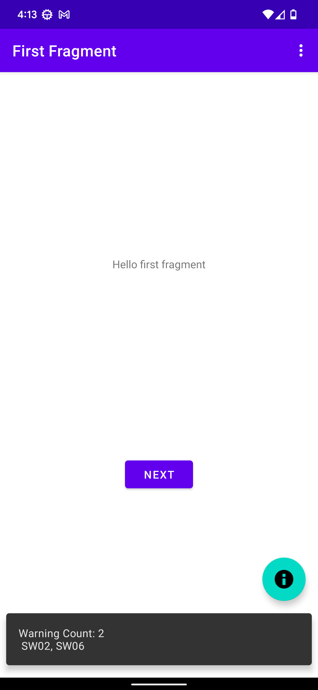

# Setup

1. enter JFROG credentials on `repo.properties.example` i.e.,
```
JFROG_USERNAME=YOUR_USERNAME_GOES_HERE
JFROG_PASSWORD=YOUR_PASSWORD_GOES_HERE
```

2. rename `repo.properties.example` to `repo.properties`

3. build the app in release mode `./gradlew ":app:assembleRelease"`


# Running the App

Once the app runs click on the FAB to read the list of errors


